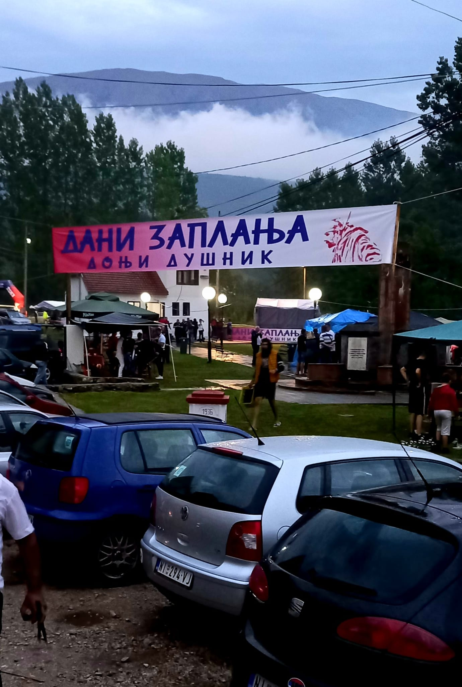
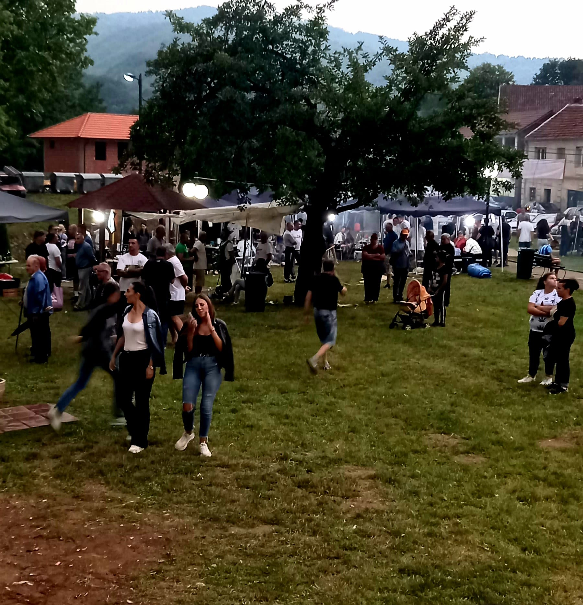
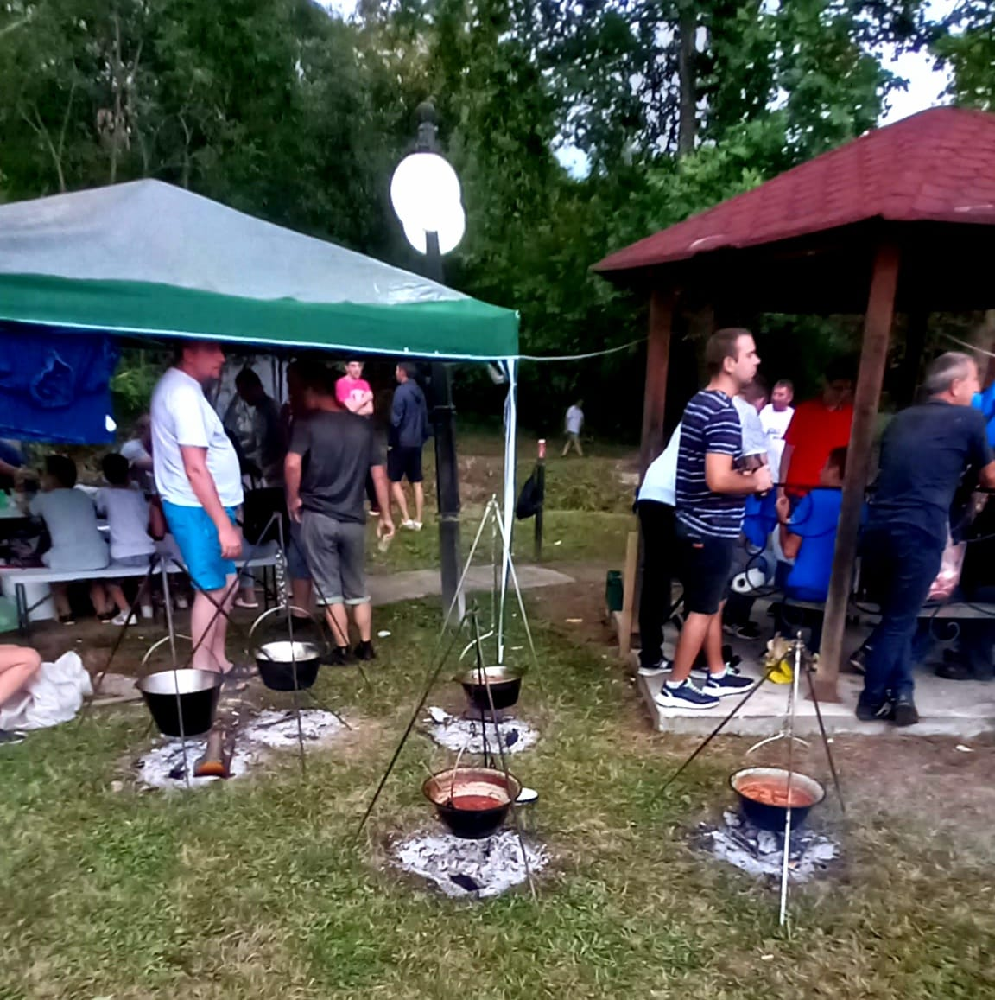

### DANI ZAPLANJA

### **[Mile Zaplanjac](https://www.facebook.com/groups/246453559759/user/100010287496671/?__cft__[0]=AZWcjDmhUr7M93UTM_LPWoiGg2EFHu3AfPQqXI-Mli8Eb13QmeDU6-_PGuY_LBnu6y0iUfMR44ig9-wjKVxZR7auzbz-hipDhwhorwiUCKIorZG7dXlmzOYoUdI1QqnyrmvmtQCta4hgEOqgAxMGmugmEltrX6HqK-gG5hnZRgKp0BNWYmSwlB9olNkQyo9eYLoWiPNR7RjdE-qAphEo_J_2&__tn__=-]C%2CP-y-R)** 

**[Јуче у 12:37](https://www.facebook.com/permalink.php?story_fbid=pfbid02Fyf7nTZAWLJwte7E1AeaiGiQGSbG1WjAw2e1AX7Efv9CKLch6caUQrED2sPRjHwdl&id=100010287496671&__cft__[0]=AZWcjDmhUr7M93UTM_LPWoiGg2EFHu3AfPQqXI-Mli8Eb13QmeDU6-_PGuY_LBnu6y0iUfMR44ig9-wjKVxZR7auzbz-hipDhwhorwiUCKIorZG7dXlmzOYoUdI1QqnyrmvmtQCta4hgEOqgAxMGmugmEltrX6HqK-gG5hnZRgKp0BNWYmSwlB9olNkQyo9eYLoWiPNR7RjdE-qAphEo_J_2&__tn__=%2CO%2CP-y-R)** · 

Juče, 20.08.2022. U Donjem Dušniku završena je ovogodišnja manifestacija "DANI ZAPLANJA" čiji je organizator bila narodna biblioteka "BRANKO MILJKOVIĆ",suorganizator MZ. Donji Dušnik, a pokrovitelj manifestacije SO Gadžin Han. Uprkos lošem vremenu, velikim zalaganjem i učesnika i organizatora manifestacija je uspešno privedena kraju. Program je bio veoma zanimljiv. Već od 11 časova počelo je takmičenje u spremanju gulaša u kotlićima u dve kategorije: lovački gulaš i juneći gulaš. Bilo je veliki broj učesnika i na kraju rezultat je sledeći: u kategoriji lovački gulaš, treće mesto osvojio je Dalibor Petković iz Donjeg Dušnika, drugo mesto Dejan Milić iz Čagrovca i pobednik, prvo mesto Ivan Ilić iz Vilandrice. U kategoriji juneći gulaš redosled je sledeći: treće mesto Stanoje Stojanović iz Donjeg Dušnika, drugo mesto Slobodan Milenković iz Velikog Krčimira i pobednik, prvo mesto Ivan Ilić iz Vilandrice. U toku manifestacije održano je i takmičenje u pevanju za prvi glas Zaplanja. Redosled je sledeći: treće mesto Anđela Bećirović, drugo mesto Raca Dinić i pobednik, prvo mesto, Đokić Miodrag. U okviru manifestacije po prvi put je održano i prvenstvo Srbije u planinskom trčanju "SUVA TREJL" u organizaciji Planinarskog saveza Srbije iz Niša i Planinarskog kluba "MOSOR" iz Niša. Start je bio iz Vrgudinca u opštini Bela Palanka, a cilj na manifestaciji u Donjem Dušniku. Staza je bila dugačka 42,9 km. sa usponom od 2700 metara. Takmičenje je održano u muškoj, ženskoj i ekipnoj konkurenciji. Rezultati su sledeći: U ženskoj konkurenciji treče mesto osvojila je ljiljana Krasić iz ekipe Mosor, drugo mesto Lidija Radulović iz ekipe Balkan Beograd i pobednica, prvo mesto lvana Živković iz ekipe Balkan Beograd. U muškoj konkurenciji, treće mesto Danijel Lončarević iz ekipe Tara Bajina Bašta, drugo mesto, Miloš Raičević iz ekipe Tara Bajina Bašta i pobednik, prvo mesto Nenad Živković iz ekipe Mosor iz Niša.U ekipnom takmičenju treće mesto osvojila je ekipa PSK " BALKAN" Beograd, drugo mesto ekipa PSK "TARA" iz Bajine Bašte i pobednik, prvo mesto PSK "MOSOR" iz Niša.Svi učesnici u svim disciplinima su dobili i prigodne nagrade. Uprkos kiši i lošem vremenu manifestaciji je prisustvovao zavidan broj posetilaca. Sve u svemu bila je ovo uspešna manifestacija, rastali smo se kasno uveče sa najavom da se iduće godine ponovo okupimo na istom mestu i ponovo se družimo. Eto ja toliko o ovoj manifestaciji, u nastavku pogledajte moj izbor fotki i video zapisa i uživajte u tome. Pozdrav za sve zaplanjce ma gde bili, kao i za sve one, koji ovo prate.