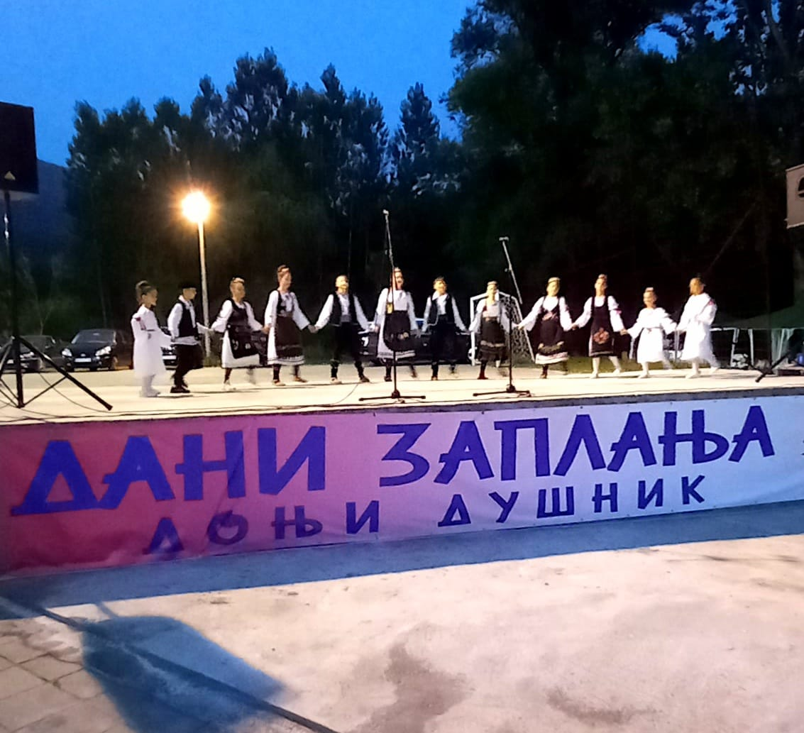
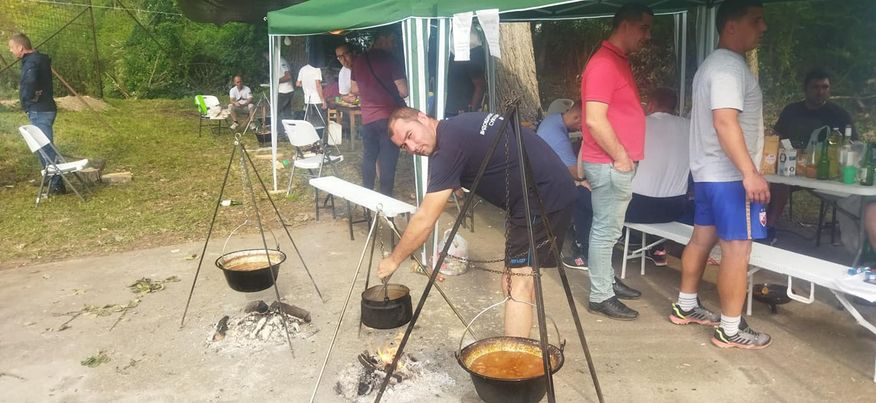
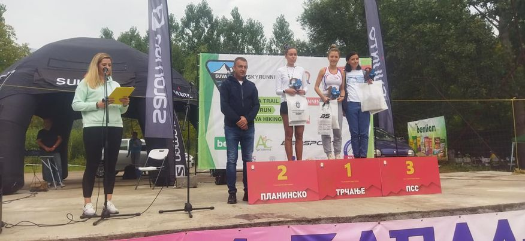

### **[Turistička organizacija opštine Gadžin Han](http://gadzinhan.rs/preduzeca-i-ustanove/turisticka-organizacija/)** је на локацији **[Donji Dusnik](https://www.facebook.com/Donji-Dusnik-108024572564982/?__cft__[0]=AZWNz0zONN-fsWiR5_G53AKRQYH6OeXxt0-NcqpO-ABsO6Gj7ee9MAL_6aX3kvJFgMPwDP1u-9ZOtg8RkGv5T8ge0AuihrvnB-HvCm3OcTAhE6p6SWBwa3HqLLmPvYsZx0i73RXbhsukYgOeIU5b1kfGQ3r_4ztv1nU-_NBlEKdE5x2iNYuH0bmW6-1cGuUGg0aR9MfS_Z61vjrGy735qFfU&__tn__=kC%2CP-y-R)**.

Упркос лошем времену, успешно су одржане две манифестације: “Дани Заплања” Народне библиотеке “Бранко Миљковић“ Гаџин Хан и Државно првенство Србије у Планинском трчању са циљем у Доњем Душнику, под покровитељством општине Гаџин Хан и уз подршку институција на локалу.

